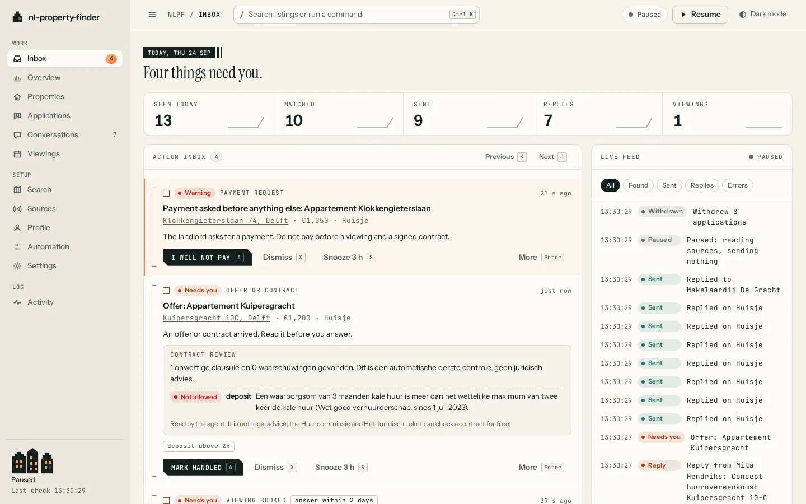
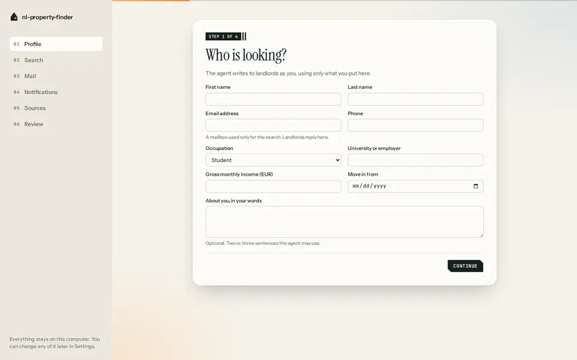

<p align="center">
  
</p>

<h1 align="center">nl-property-finder</h1>

<picture>
  <source media="(prefers-color-scheme: dark)" srcset="docs/img/dashboard-inbox-dark.webp">
  
</picture>

A rental agent for the Netherlands that runs on your own computer. It watches
the Dutch rental sites, writes to the landlord as soon as a listing matches
your search, reads the replies, answers the routine ones, books viewings inside
the times you are free, and puts only the decisions that need you in one
inbox. It starts when your computer starts and stops with one command.

Project site: <https://danieltyukov.github.io/nl-property-finder/>



## What it is

One background process on your machine, the daemon, and three ways to talk to
it: a dashboard in your browser, the `nlpf` command, and an MCP server so
Claude can read your inbox and draft replies for you.

The daemon checks every enabled source every minute or two, faster in the
hours a site usually publishes. It also reads the alert emails the platforms
send to a mailbox that exists only for your search, so a listing still arrives
when a site changes its layout. The same home on Funda, Pararius and the
agent's own website becomes one property, and is contacted once.

A matching home gets a message through the fastest free way to reach its
landlord: Funda's guest contact form, a form after one login, a platform
message, or the agent's email. When the only copy is behind a paid feature you
do not have, the agent looks for the same home somewhere free before it gives
up and hands it to you with the message ready to paste. Messages are written
from your profile in Dutch or English, with Claude when you give it a key and
from your template when you do not.

Replies are sorted as they arrive. Questions the profile can answer are
answered. A viewing slot inside your availability is accepted and added to a
calendar you can subscribe to. Offers, contracts, payment requests, identity
documents and anything uncertain come to you, on your phone, with buttons.

It also checks every match the way a careful friend would: whether the rent is
likely above the legal maximum for its size and energy label, whether the
deposit or fees are allowed, whether the listing looks like a scam, and
whether the home is still online right before anything is sent.

## What it costs

Nothing, unless you choose to use Claude.

| Part | Cost | Notes |
| --- | --- | --- |
| The agent | Free | MIT licence, runs on your computer |
| Listing sites | Free | Your own free accounts where a site needs a login. Paid plans such as Kamernet Premium are a setting for people who have them |
| Mail | Free | A dedicated Gmail account, read over IMAP with an app password |
| Phone notifications | Free | ntfy or a Telegram bot |
| Claude | Pay per use, or nothing | Only for listings that already pass your filters and for replies. Without a key the agent uses rules and templates and costs nothing |
| Hosting | Free | Nothing is hosted. This page and the site are on GitHub |

## What it will not do

It never pays, signs a contract, shares a BSN or bank details, sends an
identity document without your click, or gets past a captcha. It never
circumvents a paywall. Several large platforms forbid automated access in
their terms; for those, automatic messaging is off until you switch it on per
platform, knowing that the risk is your account on that platform.

## Sources

<!-- sources:start -->
| Source | Finds listings | Contacts automatically | How |
| --- | --- | --- | --- |
| [123Wonen](https://www.123wonen.nl) | Yes | Yes | Email |
| [Amsterdam Housing](https://www.amsterdamhousing.com) | Yes | Yes | Contact form |
| [Atrium Makelaars](https://www.atrium-makelaars.nl) | Yes | Yes | Email |
| [B&S Rental Service](https://www.bnsrentalservice.nl) | Yes | Yes | Email |
| [Bjornd Makelaardij](https://www.bjornd.nl) | Yes | Yes | Contact form |
| [Carla van den Brink Makelaars](https://www.vandenbrink.nl) | Yes | Yes | Contact form |
| [Deerenberg & Van Leeuwen Makelaars](https://www.deerenberg.nl) | Yes | Yes | Email |
| [Dekkers de Groot Makelaardij](https://www.dekkersdegroot.nl) | Yes | Yes | Email |
| [Directwonen](https://directwonen.nl) | Yes | Watch only | None |
| [Estata Makelaars](https://www.estata.nl) | Yes | Yes | Contact form |
| [Expat & Property Management](https://www.expatpropertymanagement.nl) | Yes | Yes | Contact form |
| [Expat & Real Estate](https://www.expat-realestate.nl) | Yes | Yes | Contact form |
| [Funda](https://www.funda.nl) | Yes | Opt-in | Contact form |
| [Holland2Stay](https://www.holland2stay.com) | Yes | Opt-in | Online booking |
| [HousingAnywhere](https://housinganywhere.com) | Yes | With housinganywhere-plus | Platform message |
| [Huren in Holland Rijnland](https://www.hureninhollandrijnland.nl) | Yes | After you connect | Contact form |
| [Huurstunt](https://www.huurstunt.nl) | Yes | Watch only | None |
| [Huurwoningen](https://www.huurwoningen.nl) | Yes | With huurwoningen-premium | Contact form |
| [Huurzone](https://www.huurzone.nl) | Yes | Watch only | None |
| [Interhouse](https://interhouse.nl) | Yes | Yes | Contact form |
| [Kamer.nl](https://www.kamer.nl) | Yes | With kamernl-premium | Platform message |
| [Kamernet](https://kamernet.nl) | Yes | With kamernet-premium | Platform message |
| [Keij & Stefels](https://www.keij-stefels.nl) | Yes | Yes | Contact form |
| [Lankhuijzen Makelaars](https://www.lankhuijzen.nl) | Yes | Yes | Contact form |
| [Lex van Leeuwen Makelaars](https://www.lexvanleeuwen.nl) | Yes | Yes | Contact form |
| [Marktplaats](https://www.marktplaats.nl) | Yes | Opt-in | Platform message |
| [MVGM (ikwilhuren.nu)](https://ikwilhuren.nu) | Yes | Watch only | None |
| [NederWoon](https://www.nederwoon.nl) | Yes | Watch only | None |
| [Nelisse Makelaarsgroep](https://www.nelisse.nl) | Yes | Yes | Contact form |
| [Pararius](https://www.pararius.nl) | Yes | Opt-in | Contact form |
| [Perfect Rent](https://www.perfectrent.nl) | Yes | Yes | Contact form |
| [Plaza Resident Services](https://plaza.newnewnew.space) | Yes | After you connect | Contact form |
| [Rentola](https://rentola.nl) | Yes | Watch only | None |
| [Residence Makelaars](https://www.residencemakelaars.com) | Yes | Yes | Contact form |
| [RoomMatch (DUWO and other student housing)](https://www.roommatch.nl) | Yes | After you connect | Contact form |
| [Rotsvast](https://www.rotsvast.nl) | Yes | Yes | Email |
| [SSH](https://www.sshxl.nl) | Yes | Watch only | Lottery or waiting list |
| [Stadswonen Rotterdam](https://www.stadswonenrotterdam.nl/nl/aanbod) | Yes | Watch only | None |
| [The House of Expats](https://www.thehouseofexpats.com) | Yes | Yes | Contact form |
| [Van Daal Makelaardij](https://www.vandaalmakelaardij.nl) | Yes | Yes | Email |
| [Van der Linden](https://www.vanderlinden.nl) | Yes | Watch only | None |
| [Van Paaschen Makelaardij](https://www.vanpaaschen.nl) | Yes | Yes | Contact form |
| [Verra Makelaars](https://www.verra.nl) | Yes | Yes | Contact form |
| [Vesteda](https://www.vesteda.com) | Yes | Opt-in | Contact form |
| [WoningNet (DAK)](https://www.woningnet.nl) | Yes | Watch only | None |
| [Woonnet Haaglanden](https://www.woonnet-haaglanden.nl) | Yes | After you connect | Contact form |
| [Woonnet Rijnmond](https://www.woonnetrijnmond.nl) | Yes | After you connect | Contact form |
| [WVO Makelaarsgroep](https://www.wvo.nl) | Yes | Yes | Contact form |
| [Xior](https://www.xiorstudenthousing.eu) | Yes | After you connect | Online booking |
<!-- sources:end -->

`docs/SOURCES.md` has every source's capabilities and the reason for its
default.

## Install

Requires Node 22.12 or newer and Git. On Linux, headed browser checks use Xvfb
(`sudo apt install xvfb`), which the agent starts and stops by itself.

```
git clone https://github.com/danieltyukov/nl-property-finder.git
cd nl-property-finder
npm ci
npx playwright install chromium
npm run build
npm link -w @nlpf/cli      # puts nlpf on your PATH
nlpf init                  # your profile, your search, the mailbox, notifications
nlpf on                    # start now and at every login
nlpf open                  # the dashboard
```

`nlpf off` stops it and removes it from login. `nlpf pause` keeps it reading
but stops it sending. `nlpf doctor` checks every part of the setup.

To try it with no accounts at all, `nlpf demo` runs the whole product against
the sandbox: a fake rental platform, a fake estate agent and a landlord who
answers.

## Talking to it from Claude

For Claude Code:

```
claude mcp add nl-property-finder -- nlpf mcp
```

For Claude Desktop, in `claude_desktop_config.json`:

```json
{
  "mcpServers": {
    "nl-property-finder": { "command": "nlpf", "args": ["mcp"] }
  }
}
```

Claude gets 21 tools: the inbox, listings, conversations, drafts, viewings,
searches, the profile, pause and resume, source health and stats. Tools that
message a real person say so, and `skills/nl-property-finder/SKILL.md` tells
Claude to draft first and send only when you say so. The same things are
available over a local REST API described at
`http://127.0.0.1:7431/api/v1/openapi.json`, and from `nlpf ... --json`.

## Build from source

```
git clone https://github.com/danieltyukov/nl-property-finder.git
cd nl-property-finder
npm ci
npm test
npm run demo
```

## Repository layout

    apps/daemon        the background service
    apps/dashboard     the dashboard
    apps/cli           nlpf, including the MCP server
    packages/core      types, config, store, API contract
    packages/sources   every source, and the SDK to add one
    packages/agent     matching, routing, policy, viewings, rent check
    packages/ai        Claude, rules and demo providers
    packages/mail      the mailbox and alert-email parsers
    packages/notify    phone and desktop notifications
    packages/sandbox   the fake Netherlands for demo mode and tests
    packages/design    tokens, fonts and the logo
    site/              the project site
    docs/              architecture, privacy, sources, design and research

## Documentation

- `docs/ARCHITECTURE.md`: how a listing becomes a message and a reply becomes an action.
- `docs/SOURCES.md` and `docs/ADAPTERS.md`: what each source can do, and how to add one.
- `docs/PRIVACY.md`: everything that leaves your machine.
- `CONTRIBUTING.md`: running the tests and the demo.
- `SECURITY.md`: where secrets live and how to report a problem.

## Licence

MIT, in `LICENSE`. The fonts are OFL 1.1 subsets of Instrument Serif,
Instrument Sans and JetBrains Mono, with their notice in
`packages/design/fonts/OFL.txt`.
